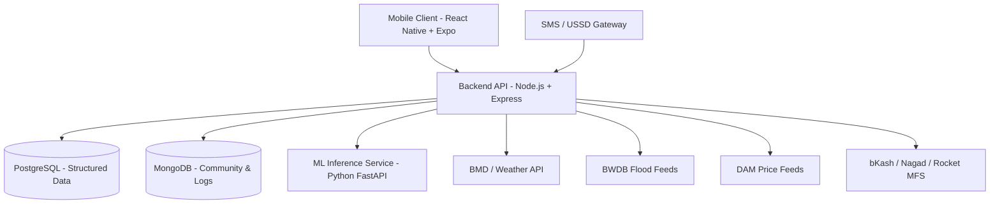

# KrishiSathi (কৃষিসাথী) 🌾
> **Integrated Agriculture & Livelihood Platform for Bangladesh**
> *Academic Project: CSE-3200 (Software Development Project-II), RUET*

---

## 📖 Overview

**KrishiSathi** is an all-in-one digital platform designed to empower Bangladeshi farmers (*krishok*), fish-farmers, and livestock rearers across the entire agricultural lifecycle. It integrates condition-based advisory, AI-powered disease diagnosis, disaster/weather warnings, and a direct farmer-to-buyer marketplace with escrow security to eliminate intermediary exploitation (*dalal*).

---

## 🚀 Key Features & Modules

### 1. 🌾 Crop Advisory Module
* **Location & Soil Recommendations:** Tailored crop suggestions based on soil N-P-K data and geographic zones.
* **AI Plant Disease Detection:** Image-based leaf disease diagnosis with confidence scoring and organic/chemical remedies.
* **Fertilizer & Irrigation Dosage:** Dosage calculator supporting local land units (*bigha, katha, decimal*) and weather-linked irrigation advisory.
* **Seasonal Crop Calendar:** Aus, Aman, Boro, and Rabi calendars with BRRI salinity- and flood-tolerant variety recommendations.

### 2. 🐟 Fishery & Aquaculture Module
* **Water Parameter Advisory:** Fish species recommendations from pH, dissolved oxygen, and ammonia levels.
* **Fish Disease & Feed Calculator:** Symptom-based disease detection and biomass feed optimization.
* **Coastal Shrimp (Chingri) & Traceability:** Salinity guidance and export-grade batch tracking for processing plants.

### 3. 🐄 Livestock & Poultry Module
* **Breed Selection & Care:** Guidance for poultry, dairy, and goat farming.
* **Health & Vaccines:** Automated vaccination schedules and DLS regional disease outbreak alerts (e.g., Bird Flu, FMD).

### 4. ⛈️ Weather & Disaster Early Warning
* **Real-time Local Weather:** BMD feeds and commercial API fallbacks.
* **Disaster Warnings:** BWDB flood alerts, cyclone trajectories, and coastal union cyclone shelter locator.

### 5. 🛒 Direct Marketplace with Escrow
* **Fair Price Discovery:** Real-time Department of Agricultural Marketing (DAM) benchmark prices.
* **Direct Bidding & Trading:** Farmer-to-buyer bidding engine bypassing middlemen.
* **Escrow-style MFS Payments:** Secure payment locking via bKash, Nagad, and Rocket released upon delivery confirmation.
* **Reputation Scoring:** Transparent rating system for buyers and farmers.

### 6. 👥 Labour & Livelihood Matchmaking
* **Seasonal Labour Exchange:** Connect farmers with nearby available agricultural labourers.
* **Monga Lean-Season Support:** Alternative income suggestions for vulnerable northern districts.

### 7. 💳 Financial Inclusion & Government Support
* **Cost-Benefit & Profit Calculator:** Seasonal financial forecasting per crop/pond cycle.
* **Govt Scheme Directory:** Subsidies (BADC), PKSF microfinance, and cold storage locator.
* **Digital History Export:** Exportable yield and transaction summaries for bank/NGO loan applications.

### 8. 📱 Inclusive & Low-Bandwidth Access
* **Bangla-First Voice UI:** Spoken Bangla voice search, speech-to-text, and audio readouts.
* **Offline-First Sync:** SQLite local caching for seamless functioning during rural network drops.
* **Feature-Phone Access (SMS/USSD):** Price lookups and disaster alerts via plain SMS and USSD menus for non-smartphone users.

---

## 🏗️ System Architecture



---

## 🛠️ Technology Stack

| Layer | Technologies |
| :--- | :--- |
| **Mobile Client** | React Native, Expo, TypeScript, React Navigation, SQLite (Offline Cache) |
| **Backend API** | Node.js, Express.js, TypeScript, Prisma / Sequelize ORM, JWT Auth |
| **Databases** | PostgreSQL (Relational Data), MongoDB (Discussions/Media), Redis (Caching) |
| **Machine Learning** | Python, FastAPI, PyTorch / TensorFlow CNN (Disease Detection), Scikit-Learn |
| **Integration** | bKash/Nagad Sandbox APIs, SMS/USSD Gateway Simulator, OpenWeather/BMD |

---

## 📁 Repository Structure

```
KrishiSathi/
├── backend/            # Node.js + Express REST API
│   ├── src/
│   │   ├── controllers/
│   │   ├── models/
│   │   ├── routes/
│   │   ├── services/
│   │   └── utils/
│   └── package.json
├── mobile/             # React Native + Expo Mobile Application
│   ├── src/
│   │   ├── assets/
│   │   ├── components/
│   │   ├── navigation/
│   │   ├── screens/
│   │   └── services/
│   └── package.json
├── ml-service/         # Python FastAPI Machine Learning Inference Microservice
│   ├── models/
│   ├── app/
│   │   ├── api/
│   │   └── core/
│   └── requirements.txt
├── docs/               # Project documentation, SRS, diagrams
│   └── KrishiSathi_Proposal-1.pdf
├── .gitignore          # Global Git Ignore rules
└── README.md           # Project Overview
```

---

## 👥 Authors & Academic Context

* **Institution:** Rajshahi University of Engineering & Technology (RUET)
* **Department:** Department of Computer Science and Engineering (CSE)
* **Course:** CSE-3200 — Software Development Project-II
* **Course Instructor:** Khaled Zinnurine, Lecturer, Dept. of CSE, RUET
* **Project Team:**
  * Ashikur Rahman
  * Nipu Das
