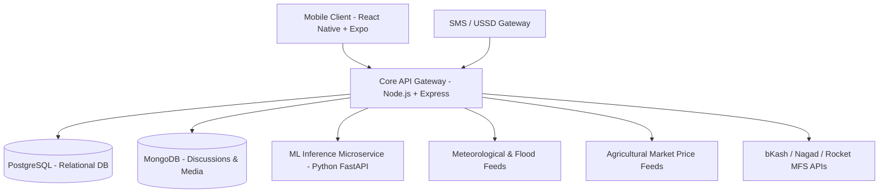

# KrishiSathi (কৃষিসাথী) 🌾
> **Integrated Agriculture & Rural Livelihood Platform for Bangladesh**

---

## 📖 Overview

**KrishiSathi** is an all-in-one digital platform designed to empower Bangladeshi farmers (*krishok*), aquaculture fish-farmers, and livestock keepers across the full agricultural lifecycle. The platform unifies hyper-localized advisory, AI-powered disease diagnosis, real-time weather and flood disaster warnings, and a direct farmer-to-buyer marketplace with secure Mobile Financial Services (bKash/Nagad/Rocket) escrow to eliminate intermediary exploitation.

Built with offline-first synchronization, Bangla-first voice interfaces, and low-bandwidth/USSD compatibility, KrishiSathi bridges the technological divide for rural communities across Bangladesh.

---

## 🚀 Core Platform Modules

### 1. 🌾 Crop Advisory & Soil Intelligence
* **Soil & Location-Based Recommendations:** Scientific crop matching based on soil N-P-K profiles and agro-ecological zones.
* **AI Plant Disease Diagnosis:** Instant leaf disease identification via computer vision with confidence scores, organic remedies, and chemical treatment regimens.
* **Fertilizer & Irrigation Optimizer:** Precise dosage calculations supporting regional land measurements (*bigha, katha, decimal*) coupled with rain-forecast-linked irrigation advisories.
* **Dynamic Crop Calendar:** Aus, Aman, Boro, and Rabi timetables featuring BRRI salinity-tolerant and flood-resilient cultivars.

### 2. 🐟 Aquaculture & Fishery Module
* **Water Quality Analytics:** Species selection and stocking recommendations tailored to pH, dissolved oxygen, and ammonia levels.
* **Fish Health & Feed Optimization:** Symptom-based disease detection and biomass-to-feed conversion calculators.
* **Coastal Shrimp (Chingri) Management:** Gher salinity monitoring and export-grade batch traceability logging.

### 3. 🐄 Livestock & Poultry Care
* **Breed Selection & Husbandry:** Best practices for commercial and homestead dairy, goat, and poultry rearing.
* **Vaccination Reminders & Disease Alerts:** Scheduled immunization tracking and automated regional outbreak notices (Bird Flu, FMD).

### 4. ⛈️ Weather & Disaster Early Warning
* **Hyper-local Weather Forecasts:** Accurate multi-day outlooks with BMD integration and weather radar fallbacks.
* **Flood & Cyclone Alerts:** River basin flood tracking and cyclone shelter locators with evacuation guidance for coastal unions.

### 5. 🛒 Direct Marketplace with Escrow Protection
* **Real-time Price Discovery:** Live wholesale and retail price benchmarks.
* **Direct Farmer-to-Buyer Trading:** Transparent bidding engine connecting farmers directly with commercial buyers and retailers.
* **MFS Escrow Engine:** In-app transaction security using bKash, Nagad, and Rocket with funds held safely until delivery verification.
* **Reputation & Trust Score:** Mutual rating system establishing verifiable transaction histories for smallholders.

### 6. 👥 Seasonal Labour & Livelihood Exchange
* **Labour Matchmaking:** On-demand matching between agricultural labourers and farm operators during peak planting and harvesting seasons.
* **Lean-Season (Monga) Income Support:** Alternative livelihood suggestions and artisanal trade opportunities for vulnerable districts.

### 7. 💳 Financial Empowerment & Government Support
* **Farm Profitability Calculator:** Cycle-by-cycle cost, revenue, and margin estimations.
* **Subsidy & Cold Storage Directory:** Up-to-date registry of agricultural subsidies, microfinance facilities, and regional cold storage capacity.
* **Verifiable Credit History:** Exportable harvest and transaction records formatted for formal banking and microfinance loan applications.

### 8. 📱 Inclusive & Offline Access
* **Bangla-First Voice UI:** Spoken Bangla voice search, speech-to-text, and natural audio readouts.
* **Offline-First Synchronization:** Local SQLite caching enabling complete functionality in remote regions with intermittent 2G/3G connectivity.
* **Feature-Phone Channel (SMS/USSD):** Plain SMS alerts and interactive USSD menus for users without smartphones.

---

## 🏗️ System Architecture



---

## 🛠️ Technology Stack

| Layer | Technologies |
| :--- | :--- |
| **Mobile Client** | React Native, Expo, TypeScript, React Navigation, SQLite (Offline Storage) |
| **Backend API** | Node.js, Express.js, TypeScript, Prisma ORM, JWT Authentication |
| **Databases** | PostgreSQL (Relational Data), MongoDB (Community & Logs), Redis (Caching) |
| **Machine Learning** | Python, FastAPI, PyTorch / TensorFlow CNNs, Scikit-Learn |
| **Integrations** | Mobile Financial Services (bKash/Nagad/Rocket), SMS/USSD Gateway, Weather APIs |

---

## 📁 Project Structure

```
KrishiSathi/
├── backend/            # Node.js + Express REST API
│   ├── src/
│   │   ├── controllers/
│   │   ├── models/
│   │   ├── routes/
│   │   ├── services/
│   │   └── utils/
│   └── package.json
├── mobile/             # React Native + Expo Mobile Application
│   ├── src/
│   │   ├── assets/
│   │   ├── components/
│   │   ├── navigation/
│   │   ├── screens/
│   │   └── services/
│   └── package.json
├── ml-service/         # Python FastAPI Machine Learning Inference Microservice
│   ├── models/
│   ├── app/
│   │   ├── api/
│   │   └── core/
│   └── requirements.txt
├── docs/               # System architecture, schemas, and specifications
└── .gitignore          # Global Git ignore rules
```

---

## 📄 License
This project is licensed under the MIT License.
